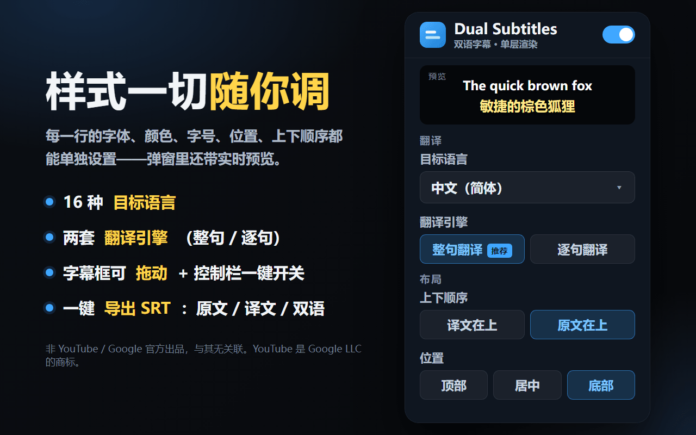

# Dual Subtitles for YouTube™（YouTube 双语字幕）

> 在 YouTube 上把**原文 + 译文**同时显示成**单层、不重叠**的字幕，并且按整句切换、不再逐词闪烁。

**English → [README.md](README.md)**

一个完全独立、开源的 **Manifest V3** 扩展。它读取视频真正的字幕轨、即时翻译，再把两种语言渲染在一个可自定义、可拖动的图层里——没有重叠，也没有逐词跳动。

---

## 功能特性

- **双语单层。** 一行原文、一行译文;YouTube 自带字幕层被隐藏,两者永不重叠。
- **整句切换,不抖动。** 直接用带时间轴的字幕 *cue*(而非屏幕上滚动刷新的文本)渲染,按整句切换,不再逐词闪。
- **两套翻译引擎。** 默认用 YouTube 自带的整轨翻译(逐句对齐、即时),并在无法翻译时**自动回退**到 Google 免费翻译接口——且会提前预取,基本无延迟。
- **高度可定制。** 每一行的字体、字号、文字色、背景色 + 透明度、描边、行间距、上下顺序都能单独设置,弹窗里有实时预览。
- **可拖动。** 抓住手柄把字幕框拖到画面任意位置,会记住;双击手柄复位。全屏下也可用。
- **一键开关。** 播放器控制栏里有个按钮,一键开/关整个插件(连带 YouTube 的 CC)——遇到自带硬字幕的视频特别方便。
- **导出 SRT。** 在弹窗里把当前视频的字幕导出成标准 `.srt` 文件——可选原文、译文或双语。
- **稳健。** 支持 YouTube 单页跳转;万一取 cue 失败会自动回退到读屏幕字幕文本;并会自动帮你打开 YouTube 字幕。

## 工作原理

YouTube 的字幕来自 `/api/timedtext` 接口,如今每次请求都需要一个 **proof‑of‑origin token(`pot`)**。扩展自己直接去拉字幕 URL 会拿到**空响应**。所以做法是:

1. 一个运行在页面主世界(MAIN world)的脚本 `inject.js` **被动**监听页面网络(XHR、`fetch`、Resource Timing),抓取**播放器自己**发出的、已经带着有效 `pot` 的那条 timedtext 请求。
2. 用这条 URL 以 `json3` 取原文 cue,再加 `&tlang=` 取 YouTube 的译文——两者逐句对齐。
3. `content.js` 按 `video.currentTime` 驱动一个覆盖层,在正确的时间显示对应整句及其译文,同时隐藏 YouTube 原生字幕层,做到单层不重叠。
4. 万一取 cue 失败,自动回退为直接读取屏幕上的字幕文本。

## 安装

### 从 Chrome 网上应用店安装(推荐)

**[➜ 从 Chrome 网上应用店安装](https://chromewebstore.google.com/detail/dual-subtitles-for-youtub/ndifcigakimmibkgeabchfaolhjpcmge)** —— 一键安装,自动更新。然后打开任意有字幕的 YouTube 视频,字幕会自动出现(扩展会替你打开 CC)。

### 加载已解压的扩展(开发者)

1. 到 [Releases 页面](https://github.com/Gythiro/yt-dual-subs/releases/latest)**下载最新版 ZIP** 并解压。*(喜欢命令行也可以直接 `git clone`。)*
2. 打开 `chrome://extensions`。
3. 打开右上角的**开发者模式**。
4. 点击**加载已解压的扩展程序**,选择解压后的文件夹。
5. 打开任意有字幕的 YouTube 视频——字幕会自动出现。

> ⚠️ **若提示「清单文件丢失或不可读取 / Manifest file is missing or unreadable」**:几乎都是解压成了**文件夹套文件夹**(`yt-dual-subs\yt-dual-subs\`)。请一直点进去,选**直接能看到 `manifest.json` 的那一层**再加载。请优先用 **Releases 页面**里的 ZIP(解压只有一层),不要用绿色 **Code** 按钮下的源码包;也要确认是**真的解压**出来、而不是在压缩包里直接加载。

支持 Chrome / Edge 等 Chromium 浏览器。需要 Chrome 111+(用于主世界 content script)。

## 使用

- **工具栏图标** → 设置弹窗:目标语言、翻译引擎、上下顺序、位置、行间距,以及每一行的样式,均带实时预览。
- **控制栏按钮**(齿轮旁边那个字幕框图标):一键开/关。**蓝色 = 开,灰色 = 关。**
- 鼠标移到播放器上,字幕框左上角会出现**拖动手柄**;拖动可移动位置,**双击手柄复位**。
- **导出**(弹窗 →「导出字幕」):把字幕下载成 `.srt` 文件——可选原文、译文或双语。

## 两套翻译引擎

| | 整句翻译(`tlang`)— 默认 | 逐句翻译(`gtx`) |
|---|---|---|
| 来源 | YouTube 服务端整轨翻译 | Google 免费翻译接口 |
| 对齐 | 完美,逐句对齐 | 逐句(已预取) |
| 适合 | 质量最高、即时 | YouTube 无法翻译该轨,或你更喜欢 Google 的措辞 |
| 备注 | 视频不可翻译时自动回退到 `gtx` | 非官方接口,重度使用可能被限流 |

## 已知限制

- 需要真正的字幕轨。**烧录进画面**的硬字幕(画进视频像素里的)无法隐藏——这类视频用控制栏按钮把覆盖层关掉即可。
- Google 回退用的是非官方接口,无 SLA,重度使用可能被限流。
- 依赖 YouTube 当前行为;YouTube 大改版时可能需要更新选择器。

## 隐私

无统计、无追踪、无账号。字幕文本**仅**发送到你选择的翻译服务(YouTube 自身或 Google 翻译)用于翻译。设置保存在 `chrome.storage.sync`。

## 开发

纯原生 JS/CSS,无需构建、无依赖。

| 文件 | 作用 |
|---|---|
| `inject.js` | 主世界嗅探:抓取播放器带 `pot` 的 timedtext URL,取 cue + 译文 |
| `content.js` | 覆盖层、cue 引擎、拖动、控制栏开关、读屏回退 |
| `background.js` | 翻译 service worker(Google 接口) |
| `popup.html/.css/.js` | 带实时预览的设置界面 |
| `content.css` | 覆盖层样式 + 隐藏原生字幕 |

## 致谢

本项目是受(已停更、闭源的)*YouTube™ Dual Subtitles* 启发的**全新独立实现**——未使用其任何代码,并从根本上解决了重叠与逐词跳动的问题。

## 许可

[MIT](LICENSE)。

---

*本扩展非 YouTube / Google LLC 官方出品，与其无任何关联，亦未获其背书或赞助。「YouTube」是 Google LLC 的商标，此处仅用于说明兼容性。*
